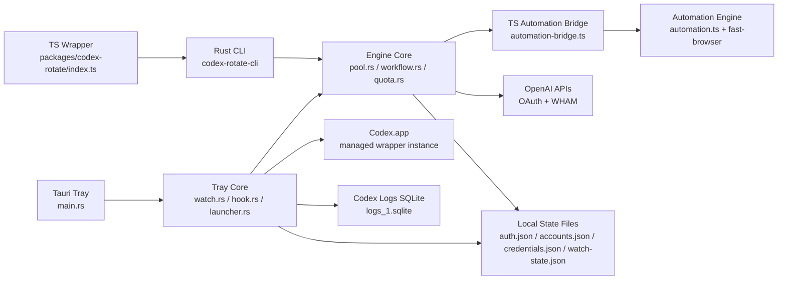
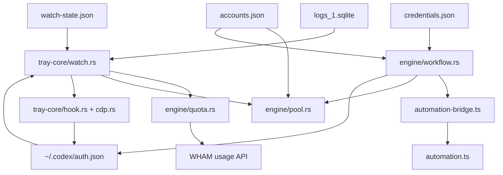
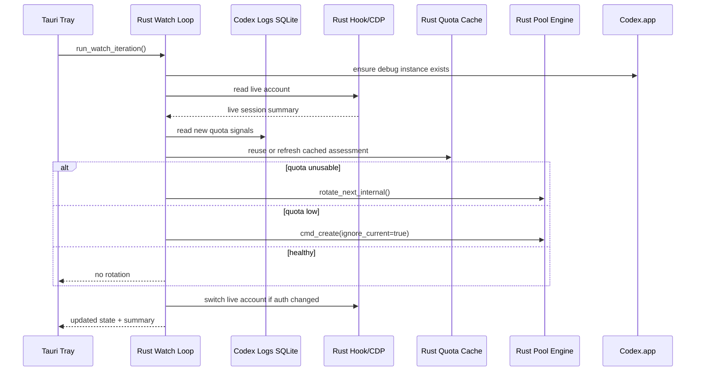
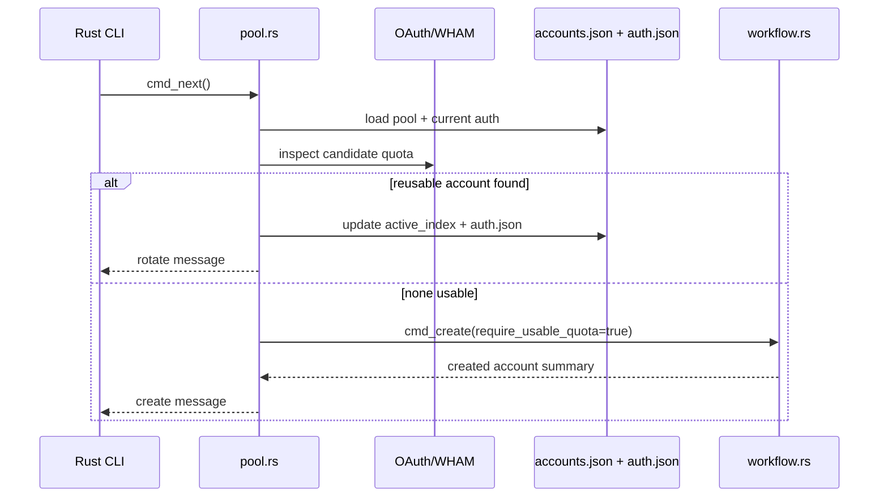
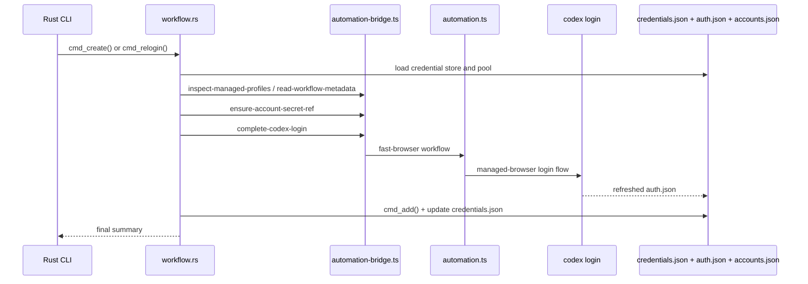

# Codex Rotate Architecture

## Summary

Codex Rotate is now a Rust-first local supervisor for Codex account rotation.

- The tray runtime is Tauri + Rust only.
- The account pool, quota inspection, watch loop, launcher, CDP session sync, and create/relogin orchestration are Rust.
- TypeScript remains only where it still adds value: `fast-browser` automation and the JSON-over-stdio bridge that calls it.
- There is no longer a Bun control plane under `packages/codex-rotate-app`.

## Runtime Map

| Layer                  | Main files                                                                          | Responsibility                                                                        |
| ---------------------- | ----------------------------------------------------------------------------------- | ------------------------------------------------------------------------------------- |
| Tray shell             | `packages/codex-rotate-app/src-tauri/src/main.rs`                                   | Tray menu, background polling, user actions                                           |
| Tray runtime core      | `packages/codex-rotate-app/crates/codex-rotate-tray-core/src/*.rs`                  | Watch loop, launcher, CDP, log ingestion, live-session sync                           |
| Shared engine core     | `packages/codex-rotate/crates/codex-rotate-core/src/*.rs`                           | Auth parsing, quota cache, pool engine, create/relogin orchestration                  |
| Rust CLI               | `packages/codex-rotate/crates/codex-rotate-cli/src/main.rs`                         | Stable `codex-rotate` command surface                                                 |
| TS wrapper             | `packages/codex-rotate/index.ts`                                                    | Thin launcher into the Rust CLI                                                       |
| TS automation boundary | `packages/codex-rotate/automation.ts`, `packages/codex-rotate/automation-bridge.ts` | `fast-browser`, workflow metadata, Bitwarden secret refs, managed-browser Codex login |

## Component Diagram



## State and File Ownership

| File                                   | Owner                | Notes                                                                                        |
| -------------------------------------- | -------------------- | -------------------------------------------------------------------------------------------- |
| `~/.codex/auth.json`                   | Codex + Rust core    | Canonical active account tokens                                                              |
| `~/.codex/logs_1.sqlite`               | Codex                | Signal source for `usage_limit_reached` and `account/rateLimits/updated`                     |
| `~/.codex-rotate/accounts.json`        | Rust pool engine     | Account pool, active slot, cached per-account quota summaries                                |
| `~/.codex-rotate/credentials.json`     | Rust workflow engine | Stored families, accounts, pending creates; backward-compatible with legacy password records |
| `~/.codex-rotate-app/watch-state.json` | Tray runtime core    | Last signal cursor, cooldown, cached quota assessment                                        |
| `~/.codex-rotate-app/session.json`     | Tray runtime core    | Wrapper Codex launch metadata                                                                |
| `~/.codex-rotate-app/profile/`         | Tray runtime core    | Dedicated wrapper profile for remote-debugging                                               |

## Data Flow



## Hot Paths

### 1. Background watch iteration



### 2. `codex-rotate next`



### 3. `codex-rotate create` / `relogin`



## Quota Cache Policy

The watch loop still runs every 15 seconds, but WHAM is not called every 15 seconds anymore.

Refresh rules:

- Always refresh on startup if there is no cached quota state.
- Refresh after rotate/create/relogin success.
- Refresh when the auth account changes.
- Refresh when `usage_limit_reached` is seen.
- Refresh when `account/rateLimits/updated` is newer than the cached assessment.
- Otherwise reuse cache until `nextRefreshAt`.

TTL policy:

- `>20%` primary quota left: 5 minutes
- `10-20%`: 90 seconds
- `<=10%`, unusable quota, or probe error: 30 seconds

The cache is stored additively inside `watch-state.json`:

```json
{
  "quota": {
    "accountId": "acct_...",
    "fetchedAt": "2026-04-03T12:00:00.000Z",
    "nextRefreshAt": "2026-04-03T12:05:00.000Z",
    "summary": "5h 40% left | week 0% left, 1d reset",
    "usable": true,
    "blocker": null,
    "primaryQuotaLeftPercent": 40,
    "error": null
  }
}
```

## Remaining TypeScript Surface

Only these runtime TS files remain intentional:

- `packages/codex-rotate/index.ts`
  Thin Bun entrypoint that launches the Rust CLI.
- `packages/codex-rotate/automation-bridge.ts`
  JSON-over-stdio bridge for the four automation commands.
- `packages/codex-rotate/automation.ts`
  `fast-browser`, workflow metadata, Bitwarden secret refs, managed-browser wrapper, and Codex login automation.
- `packages/codex-rotate/codex-login-managed-browser-opener.mjs`
  Browser opener shim used by the managed Codex login wrapper.

Everything that used to live in `packages/codex-rotate-app/*.ts` has been removed.

## Design Notes

### Why the split still exists

The Rust core now owns all stable runtime logic. TypeScript remains only where the dependency stack is already JS-native and volatile:

- `fast-browser`
- Playwright-driven login automation
- Bitwarden daemon helpers
- workflow metadata parsing already coupled to the automation package

That keeps the cross-language boundary narrow and explicit.

### Why the tray is now cleaner

Before this migration, the tray depended on a Bun controller layer inside `packages/codex-rotate-app`.

Now:

- tray menu actions call Rust directly
- the watch loop is Rust only
- live-account sync is Rust only
- quota caching is Rust only
- the Bun bridge is only entered during automation-specific flows

## Risks

### Tight coupling to Codex internals

The launcher, CDP session control, and log parsing still depend on Codex desktop behavior remaining stable:

- renderer message contract
- wrapper app launch behavior
- sqlite log strings for quota-related signals

Those assumptions are now centralized in Rust, which is better, but they still exist.

### Automation bridge still requires Bun and the sibling skill repo

The steady-state tray path is Rust-only, but `create` and stored-credential `relogin` still require:

- Bun
- the shared `ai-rules` repo next to this repo
- `fast-browser`
- Playwright

That is intentional for now, but it is still a deployment constraint.

### Cross-process mutation is narrower, not fully serialized

The migration removed the old Bun controller duplication, but concurrent tray actions can still overlap with CLI actions unless higher-level locking is added.

## Better Spec

The current architecture is now close to the intended split:

- Rust owns the durable application/runtime model.
- TS owns the browser automation edge.

The next cleanup target should be hardening, not another language migration:

1. Add a single-flight lock around rotate/create/relogin/watch side effects.
2. Stream bridge stderr to the parent process without widening the JSON protocol.
3. Add fixture-based compatibility tests for `create` and `relogin`.
4. Add a small contract test suite for Codex CDP + log assumptions.
