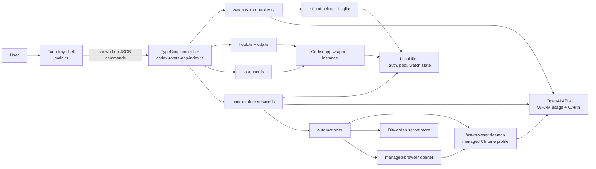
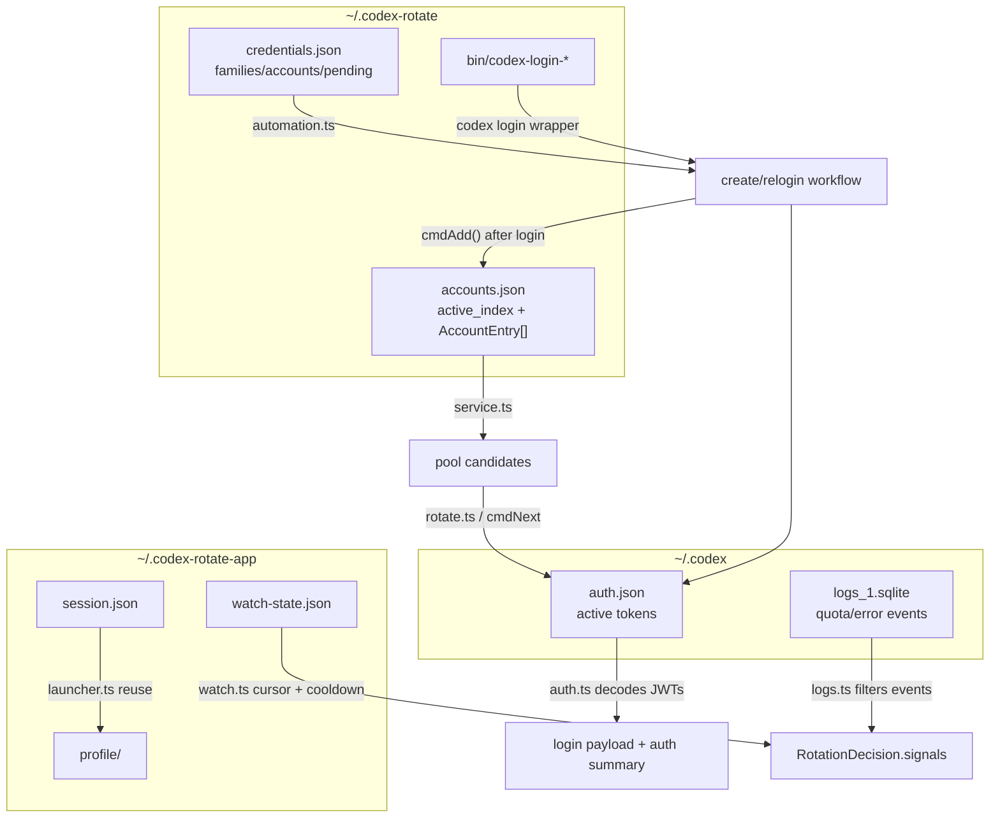
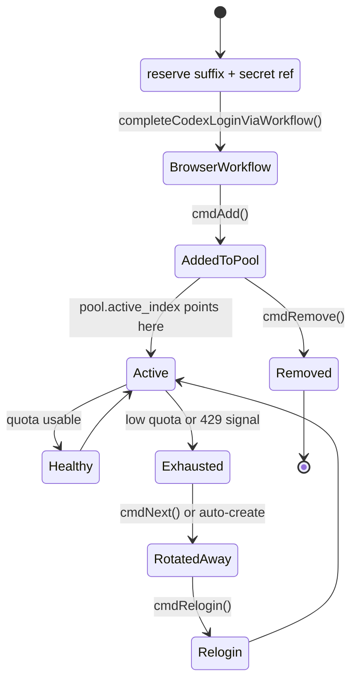
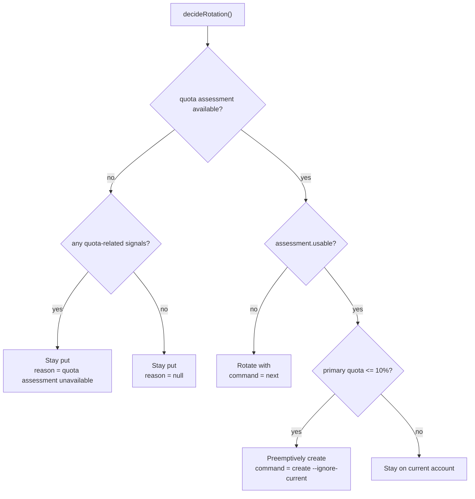
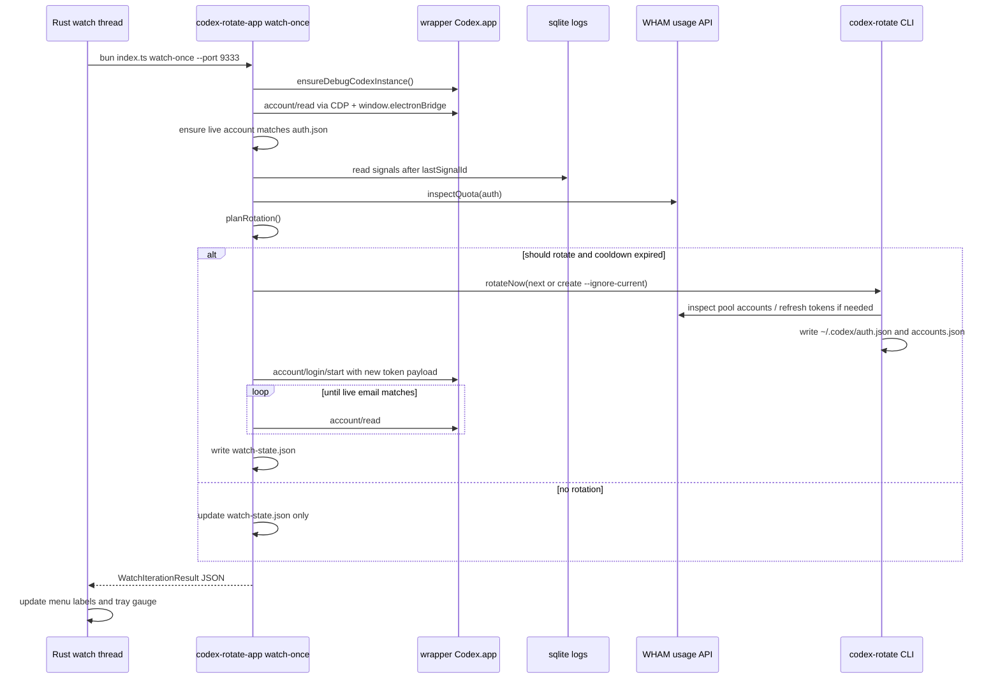
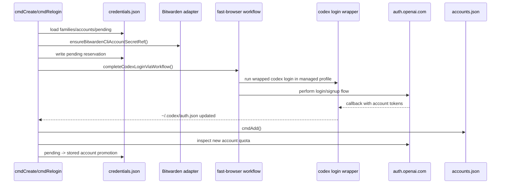

# Codex Rotate App Architecture

## 0. Summary

- Repo: `ai-tools`
- Focus: `packages/codex-rotate-app` plus the `packages/codex-rotate` engine it shells into
- Branch/commit: `main` @ `7e7207c4b864`
- Audit date: `2026-04-03`
- Mission: Keep a dedicated Codex desktop wrapper instance on a ChatGPT account that still has usable quota, then rotate, create, or relogin accounts without manual token file editing.
- High-level verdict: This is not a traditional desktop app. The Tauri layer is a tray-only shell, the TypeScript app is a local orchestration service, and the real state mutations live in the shared `codex-rotate` CLI engine. The architecture is pragmatic and surprisingly modular for a small tool, but it is operationally brittle because runtime success depends on a local source checkout, Bun, Node, Ruby, sqlite3, Codex.app internals, and a sibling `ai-rules` repo.

## 1. Stack + Build

| Area | Current shape | Evidence |
| --- | --- | --- |
| Workspace | Bun monorepo with `packages/*` workspaces | `package.json:2-12`, `README.md:1-27` |
| Desktop shell | Rust + Tauri 2 tray app with no real window | `packages/codex-rotate-app/src-tauri/Cargo.toml:1-16`, `packages/codex-rotate-app/src-tauri/tauri.conf.json:6-16` |
| Controller runtime | Bun-executed TypeScript CLI app | `packages/codex-rotate-app/package.json:7-19`, `packages/codex-rotate-app/index.ts:50-123` |
| Rotation engine | Bun-executed TypeScript CLI service | `packages/codex-rotate/index.ts:1-285`, `packages/codex-rotate/service.ts:1337-1799` |
| Browser automation | `fast-browser` daemon + Playwright + managed Chrome profiles | `packages/codex-rotate/automation.ts:20-60`, `packages/codex-rotate/codex-login-managed-browser-opener.mjs:1-107` |
| External services | OpenAI OAuth token refresh + ChatGPT WHAM usage API | `packages/codex-rotate/service.ts:45-46`, `packages/codex-rotate-app/quota.ts:10-15` |
| Test surface | Bun unit tests for app and CLI logic | `packages/codex-rotate-app/core.test.ts`, `packages/codex-rotate/index.test.ts`, `packages/codex-rotate/automation.test.ts` |

### Build and verification commands

- `bun test`
- `cargo check --manifest-path packages/codex-rotate-app/src-tauri/Cargo.toml`
- `bun run --cwd packages/codex-rotate-app tray:dev`
- `bun run --cwd packages/codex-rotate-app tray:build`

### Packaging reality

- The tray shell is compiled by Tauri, but runtime behavior still shells out to `bun packages/codex-rotate-app/index.ts ...` from the repository root (`packages/codex-rotate-app/src-tauri/src/main.rs:198-237`).
- The browser automation layer also expects a sibling `../ai-rules/skills/fast-browser/...` checkout and local `node_modules/playwright` (`packages/codex-rotate/automation.ts:20-49`).
- In practice, this behaves like a developer workstation tool, not a standalone desktop binary.

## 2. System Architecture

### Component map

| Component | Primary files | Responsibility | Talks to |
| --- | --- | --- | --- |
| Tray shell | `packages/codex-rotate-app/src-tauri/src/main.rs` | Owns menu, tray icon, polling thread, and state snapshot shown to the user | Bun controller |
| Thin frontend | `packages/codex-rotate-app/app/index.html` | Placeholder page; no meaningful UI logic | None |
| App command router | `packages/codex-rotate-app/index.ts` | Exposes CLI-like subcommands for launch, watch, quota, switch, and rotation | Controller modules |
| Rotation controller | `packages/codex-rotate-app/controller.ts` | Reads quota/signals and decides whether to stay, rotate, or create | `quota.ts`, `logs.ts`, `rotate.ts` |
| Codex adapters | `packages/codex-rotate-app/hook.ts`, `cdp.ts`, `launcher.ts` | Launches wrapper Codex, connects to CDP, injects MCP requests into renderer | Codex.app renderer |
| State adapters | `packages/codex-rotate-app/auth.ts`, `paths.ts`, `logs.ts`, `watch.ts` | Reads local auth/log files, persists watch/session state, enforces cooldown | Local files, sqlite3 |
| Rotation engine | `packages/codex-rotate/service.ts` | Owns account pool, quota inspection, token refresh, next/prev/create/relogin/remove | OpenAI APIs, local files, automation |
| Automation engine | `packages/codex-rotate/automation.ts` | Manages fast-browser workflows, credential families, Bitwarden refs, wrapper scripts | fast-browser, Bitwarden, Playwright |
| Browser shim | `packages/codex-rotate/codex-login-managed-browser-opener.mjs` | Opens the OpenAI auth URL inside a managed Chrome profile | Playwright CDP, fast-browser |

### Architectural observation

- Rust never talks to OpenAI, sqlite, or Codex internals directly. It only shells into Bun JSON commands (`packages/codex-rotate-app/src-tauri/src/main.rs:211-272`).
- The TypeScript app never renders UI. It behaves as a local orchestration daemon exposed as a CLI (`packages/codex-rotate-app/index.ts:50-123`).
- The shared CLI package is the true business-core boundary. The tray app mainly adds polling, live-session synchronization, and a tray status surface.

### System diagram



## 3. Data + Schemas

### Persistent and semi-persistent state

| Path | Owner | Shape | Purpose |
| --- | --- | --- | --- |
| `~/.codex/auth.json` | Codex + rotation engine | OAuth token set | Canonical active account for the wrapper instance and CLI (`packages/codex-rotate-app/auth.ts:52-140`, `packages/codex-rotate/service.ts:356-382`) |
| `~/.codex/logs_1.sqlite` | Codex | SQLite `logs` table | Signal source for `usage_limit_reached` and `account/rateLimits/updated` (`packages/codex-rotate-app/logs.ts:45-107`) |
| `~/.codex-rotate/accounts.json` | rotation engine | `{ active_index, accounts[] }` | Account pool, cached quota summary, active slot (`packages/codex-rotate/service.ts:339-351`) |
| `~/.codex-rotate/credentials.json` | automation engine | `{ families, accounts, pending }` | Stored and pending create/relogin credentials, mostly via Bitwarden refs (`packages/codex-rotate/automation.ts:300-368`) |
| `~/.codex-rotate/bin/codex-login-*` | automation engine | shell wrapper script | Forces `codex login` to open auth URLs inside a managed profile (`packages/codex-rotate/automation.ts:1048-1078`) |
| `~/.codex-rotate-app/session.json` | launcher | launch metadata | Last launched wrapper Codex app path, port, profile dir (`packages/codex-rotate-app/launcher.ts:23-35`) |
| `~/.codex-rotate-app/watch-state.json` | watch loop | last signal/account/rotation | Persists polling cursor and cooldown state (`packages/codex-rotate-app/watch.ts:83-110`) |
| `~/.codex-rotate-app/profile/` | launcher | Chromium user-data-dir | Dedicated Codex wrapper profile for remote-debug automation (`packages/codex-rotate-app/paths.ts:20-34`, `packages/codex-rotate-app/launcher.ts:42-80`) |

### Core domain records

- `AccountEntry` in the pool combines identity, full auth payload, and cached quota inspection fields. This lets `cmdNext` make a fast round-robin decision before re-checking every account (`packages/codex-rotate/service.ts:56-71`, `packages/codex-rotate/service.ts:1004-1071`, `packages/codex-rotate/service.ts:1477-1557`).
- `CredentialStore` separates `families`, `accounts`, and `pending` entries. The `pending` map is critical because `create` is resumable and intentionally drains unfinished suffixes first (`packages/codex-rotate/automation.ts:65-109`, `packages/codex-rotate/automation.ts:528-598`, `packages/codex-rotate/service.ts:1200-1238`).
- `WatchState` is the app-level cursor that prevents every tray refresh from replaying old log events and suppresses immediate back-to-back rotations (`packages/codex-rotate-app/watch.ts:12-31`, `packages/codex-rotate-app/watch.ts:151-210`).
- Rust `StatusSnapshot` is in-memory only and exists to drive menu labels and the tray icon gauge, not as a source of truth (`packages/codex-rotate-app/src-tauri/src/main.rs:124-137`, `packages/codex-rotate-app/src-tauri/src/main.rs:317-358`).

### Data flow diagram



### Account lifecycle diagram



## 4. Runtime Flows (Hot Paths)

### 4.1 Tray startup and steady state

- Tauri starts as an accessory app, builds a tray menu, launches the wrapper Codex instance opportunistically, refreshes live account state once, then starts a 15 second polling loop (`packages/codex-rotate-app/src-tauri/src/main.rs:463-559`).
- The tray icon is a generated ring gauge, not a bundled asset. The current quota percentage drives both the icon alpha and the tray title (`packages/codex-rotate-app/src-tauri/src/main.rs:65-115`, `packages/codex-rotate-app/src-tauri/src/main.rs:317-358`).
- The Rust loop calls `watch-once`, not `watch-live`, so each cycle is a fresh short-lived Bun process with JSON output (`packages/codex-rotate-app/src-tauri/src/main.rs:267-405`, `packages/codex-rotate-app/index.ts:97-111`).

### 4.2 Rotation decision logic

- `decideRotation()` reads filtered Codex signals from sqlite, loads the current auth file, probes the WHAM usage API, and feeds everything into `planRotation()` (`packages/codex-rotate-app/controller.ts:17-89`).
- The decision policy is intentionally simple:
  - no quota assessment -> do not rotate, but keep the reason if there were relevant signals
  - unusable quota -> rotate with `next`
  - quota still usable but at or below 10 percent -> preemptively `create --ignore-current`
  - otherwise stay put



### 4.3 Automatic watch-triggered rotation

- `runWatchIteration()` is the hot path behind both the Rust polling loop and the CLI `watch-once` command (`packages/codex-rotate-app/watch.ts:162-220`).
- Before it even considers rotation, it ensures the wrapper Codex instance exists and that the live logged-in account matches the tokens currently on disk. If they drift, it repairs the live session first (`packages/codex-rotate-app/watch.ts:127-149`, `packages/codex-rotate-app/hook.ts:113-142`).
- Auto-rotation is gated by a persisted cooldown window to avoid repeated back-to-back swaps (`packages/codex-rotate-app/watch.ts:151-210`).



### 4.4 Manual rotate now

- The menu action does not reuse the watch path. It runs `rotate-next-and-switch`, which always calls `rotateNow()` with the default `next` command, then forces a live-session switch (`packages/codex-rotate-app/index.ts:91-96`, `packages/codex-rotate-app/src-tauri/src/main.rs:248-265`, `packages/codex-rotate-app/src-tauri/src/main.rs:406-429`).
- This means manual rotation is narrower than automatic low-quota behavior. The watch path can escalate to `create`; the manual menu path cannot.

### 4.5 Create and relogin workflow

- `cmdCreate()` first tries to reuse a healthy cached or freshly-inspected pool account. Only when reuse fails or `--force` is set does it enter the browser automation workflow (`packages/codex-rotate/service.ts:1420-1475`).
- `executeCreateFlow()` reserves a pending credential, stores or reuses a Bitwarden-backed secret reference, then calls `completeCodexLoginViaWorkflow()` with managed profile metadata (`packages/codex-rotate/service.ts:1169-1335`).
- `completeCodexLoginViaWorkflow()` is the most sophisticated subsystem in the repo. It supports replay passes, multi-attempt retries, device-auth rate-limit backoff, and a `restoreState()` callback to put `~/.codex/auth.json` back if the flow fails (`packages/codex-rotate/automation.ts:1601-1755`).



## 5. API Surface

### App CLI commands

| Command | Purpose | Used by |
| --- | --- | --- |
| `auth-summary` | Print decoded auth summary from `auth.json` | debugging |
| `build-login-request` | Emit sanitized or full `account/login/start` MCP envelope | debugging and hook validation |
| `launch` | Ensure wrapper Codex is running on remote debugging port | Rust launch action |
| `account-read` | Ask live Codex which account is active | Rust refresh and switch polling |
| `quota-read` | Probe WHAM usage for current auth | Rust menu refresh |
| `switch-live` | Push current `auth.json` into live Codex renderer | session drift repair |
| `rotate-next-and-switch` | Run `next`, then push result into live Codex | manual tray rotate |
| `watch-live` / `watch-once` | Continuous or one-shot watch loop | `watch-once` is used by Rust |
| `probe-signals` | Show raw rotation decision inputs | debugging |
| `rotate-now` | Run raw rotate command and print result | debugging |

### Internal contracts

| Contract | Shape | Producer | Consumer |
| --- | --- | --- | --- |
| `account/login/start` | MCP request envelope with `chatgptAuthTokens` payload | `auth.ts`, `hook.ts` | Codex renderer via `window.electronBridge` |
| `account/read` | MCP request envelope with empty params | `hook.ts` | Codex renderer |
| `WatchIterationResult` JSON | `state`, `decision`, `rotation`, `live` | `watch.ts` | Rust tray |
| rotation command JSON | `summary`, `loginPayload` | `rotate.ts` / controller | Rust tray and debugging commands |

### External calls and executables

| Interface | Where used | Purpose |
| --- | --- | --- |
| `https://chatgpt.com/backend-api/wham/usage` | app quota probe and CLI service | quota inspection |
| `https://auth.openai.com/oauth/token` | CLI service | refresh expired access tokens |
| `sqlite3 -json` | `logs.ts` | read Codex log signals |
| `open -na /Applications/Codex.app --args ...` | `launcher.ts` | start wrapper Codex instance |
| `bun <entry>.ts ...` | Rust shell, app rotation adapter | run TypeScript orchestration |
| `codex login/logout` | CLI service + automation wrappers | account login lifecycle |
| `node --input-type=module -e ...` | `automation.ts` | fast-browser daemon bridge |
| `ruby -e ...` | `automation.ts` | parse workflow YAML metadata |
| `ps -Ao pid=,command=` | automation + browser shim | find managed profile runtime and debug port |

## 6. Observability + Ops

### What is observable

- Tray menu items show account, plan, quota summary, status message, and last rotation email (`packages/codex-rotate-app/src-tauri/src/main.rs:471-549`).
- Tray icon is a generated quota gauge plus a numeric title when quota percent is known (`packages/codex-rotate-app/src-tauri/src/main.rs:317-358`).
- `fast-browser` progress is streamed through stderr events and rewritten as readable lines by `automation.ts` (`packages/codex-rotate/automation.ts:1240-1385`).
- The managed-browser opener logs to a temp file by default: `CODEX_ROTATE_BROWSER_SHIM_LOG` or `/tmp/codex-rotate-managed-browser-opener.log` (`packages/codex-rotate/codex-login-managed-browser-opener.mjs:21-38`).

### Timing and retry behavior

| Control | Value | Evidence |
| --- | --- | --- |
| Tray watch interval | 15 seconds | `packages/codex-rotate-app/src-tauri/src/main.rs:17`, `packages/codex-rotate-app/src-tauri/src/main.rs:456-460` |
| Tray quota refresh interval | 60 seconds | `packages/codex-rotate-app/src-tauri/src/main.rs:18`, `packages/codex-rotate-app/src-tauri/src/main.rs:307-315` |
| App HTTP timeout | 8 seconds | `packages/codex-rotate-app/quota.ts:11`, `packages/codex-rotate/service.ts:47` |
| Switch-live poll timeout | 15 seconds, 750 ms polling | `packages/codex-rotate-app/hook.ts:127-140` |
| Watch cooldown | 15 seconds default | `packages/codex-rotate-app/watch.ts:46-47`, `packages/codex-rotate-app/watch.ts:151-210` |
| Create/relogin retry attempts | up to 6 attempts, 5 replay passes | `packages/codex-rotate/automation.ts:1618-1755` |

### Configuration surface

| Variable | Effect |
| --- | --- |
| `CODEX_HOME` | overrides Codex auth and logs location |
| `CODEX_ROTATE_APP_RUNTIME` | overrides runtime used to invoke the app TypeScript entry |
| `BUN_BIN` | overrides Rust-side Bun executable |
| `CODEX_ROTATE_CODEX_BIN` | overrides `codex` binary used by CLI service |
| `CODEX_REFRESH_TOKEN_URL_OVERRIDE` | overrides OAuth refresh endpoint |
| `CODEX_ROTATE_FAST_BROWSER_SCRIPT` | overrides fast-browser script path |
| `CODEX_ROTATE_FAST_BROWSER_RUNTIME` | overrides runtime used to invoke fast-browser |
| `FAST_BROWSER_PROFILE` | selects managed profile for browser opener |
| `CODEX_ROTATE_BROWSER_SHIM_LOG` | overrides browser shim log path |

### Operational prerequisites

- macOS-style `open`
- local `Codex.app`
- Bun
- Node
- Ruby
- sqlite3
- Playwright in the workspace `node_modules`
- fast-browser skill repo available next to this repository
- Bitwarden-compatible secret store via fast-browser for fully automated create/relogin

## 7. Quality + Risks

### Verified quality surface

- `bun test` passed: 61 tests across app and CLI logic.
- `cargo check --manifest-path packages/codex-rotate-app/src-tauri/Cargo.toml` passed.
- Tests cover JWT parsing, quota formatting, signal filtering, account-family math, pending credential reuse, and rotation heuristics.

### Coverage gaps

- No end-to-end test drives Tauri -> Bun -> CDP -> Codex renderer.
- No integration test validates the `account/login/start` and `account/read` message contracts against a real Codex build.
- No automated test covers `launch` on a real workstation or the fast-browser workflow bridge.
- No CI workflow is present in this repo snapshot; verification is local and manual.

### Primary architectural risks

| Risk | Why it matters | Evidence |
| --- | --- | --- |
| Tight upstream coupling to Codex internals | The app assumes the renderer target is `app://-/index.html`, that `window.electronBridge.sendMessageFromView()` exists, and that specific sqlite log strings are stable. Any Codex desktop internal change can break rotation without compile-time warning. | `packages/codex-rotate-app/cdp.ts:35-76`, `packages/codex-rotate-app/hook.ts:39-106`, `packages/codex-rotate-app/logs.ts:28-107` |
| Long local toolchain dependency chain | Successful create/relogin requires Bun, Node, Ruby, sqlite3, Codex, Playwright, fast-browser, and Bitwarden integration. Failure modes are spread across processes and repos. | `packages/codex-rotate/automation.ts:20-49`, `packages/codex-rotate/automation.ts:1258-1385`, `packages/codex-rotate-app/src-tauri/src/main.rs:211-272` |
| Side-effect concurrency is not serialized | The background watch thread and menu actions each spawn their own worker thread/processes and can overlap while mutating shared auth/pool/live-session state. | `packages/codex-rotate-app/src-tauri/src/main.rs:456-559`, `packages/codex-rotate-app/watch.ts:162-220`, `packages/codex-rotate-app/rotate.ts:15-37` |
| Packaging mismatch | The desktop bundle is marketed as a Tauri app, but the true runtime is repo-relative TypeScript plus sibling repo assets. | `packages/codex-rotate-app/src-tauri/src/main.rs:198-237`, `packages/codex-rotate/automation.ts:20-60`, `packages/codex-rotate-app/paths.ts:20-34` |

### Performance notes

- CPU and memory use are light; this tool is dominated by process spawns, filesystem reads, sqlite shell-outs, and remote HTTP checks.
- The watch loop is intentionally one-shot and process-isolated. That is operationally safe for leaks, but expensive relative to keeping a warm worker.
- The biggest latency spikes come from OpenAI usage checks, Codex launch latency, and fast-browser replay/retry loops.

### Security notes

- Secrets are mostly pushed toward Bitwarden refs instead of plain-text storage, which is the right direction (`packages/codex-rotate/automation.ts:309-356`).
- Auth tokens still live on disk in `~/.codex/auth.json` and inside pool entries by design.
- The app redacts access tokens when printing preview or sanitized login requests (`packages/codex-rotate-app/auth.ts:107-146`).
- There is no remote inbound network surface; trust boundaries are local-process and third-party API boundaries.

## 8. Issues Found (Actionable)

| Severity | Area | Evidence | Problem | Recommended fix |
| --- | --- | --- | --- | --- |
| major | Packaging/runtime model | `packages/codex-rotate-app/src-tauri/src/main.rs:198-237`, `packages/codex-rotate-app/paths.ts:20-34`, `packages/codex-rotate/automation.ts:20-49` | The tray binary resolves a compile-time repo root, shells into `bun`, executes TypeScript source files, and expects a sibling `ai-rules` repository plus workspace `node_modules`. A built tray bundle is therefore not self-contained. | Decide explicitly between `dev workstation tool` and `distributable app`. If it should be distributable, embed or port the controller/automation logic into packaged assets or Rust, and replace repo-relative path discovery with runtime-configured asset lookup. |
| major | Platform support mismatch | `packages/codex-rotate-app/src-tauri/tauri.conf.json:13-15`, `packages/codex-rotate-app/launcher.ts:37-80` | Tauri is configured to bundle for `all` targets, but launch logic hardcodes `/Applications/Codex.app` and uses the macOS `open` command. Non-macOS bundles will build misleading artifacts that cannot launch Codex. | Either restrict bundle targets to macOS or introduce an OS-specific launcher abstraction with app discovery per platform. |
| minor | Concurrent side effects | `packages/codex-rotate-app/src-tauri/src/main.rs:456-559`, `packages/codex-rotate-app/watch.ts:162-220`, `packages/codex-rotate-app/rotate.ts:15-37` | The watch loop, `Check Now`, `Rotate Now`, and `Open Wrapper Codex` each start independent workers. There is no single-flight guard around file writes, live-session switching, or rotation commands. | Add a single operation queue or mutex around side-effecting tasks so only one launch/check/rotate workflow can run at a time. |

## 9. Opportunities / Better Spec

- Split the codebase into explicit ports:
  - `CodexSessionAdapter` for CDP and MCP injection
  - `QuotaProbe` for WHAM usage and token refresh
  - `AccountPoolEngine` for pool mutation and account-family logic
  - `AutomationProvider` for fast-browser/Bitwarden
- Treat Codex internals as a versioned adapter with a smoke-test contract. Today the assumptions are spread across `cdp.ts`, `hook.ts`, and `logs.ts`.
- Collapse duplicated quota logic between app and CLI into a shared library module. The app and service each implement nearly identical usage parsing and blocker formatting.
- Add a real integration harness with a fake CDP page and fake OpenAI responses so the Tauri/Bun boundary can be tested without a live Codex instance.
- Define two operating modes explicitly:
  - `repo mode` for the current developer-workstation architecture
  - `bundled mode` with packaged assets and no repo-relative assumptions

## 10. Appendix

### Key file inventory

```text
packages/
  codex-rotate/
    index.ts
    service.ts
    automation.ts
    codex-login-managed-browser-opener.mjs
    *.test.ts
  codex-rotate-app/
    index.ts
    controller.ts
    watch.ts
    hook.ts
    cdp.ts
    launcher.ts
    logs.ts
    auth.ts
    quota.ts
    paths.ts
    src-tauri/src/main.rs
    app/index.html
    core.test.ts
```

### Commands used during this audit

- `rg --files`
- `sed -n ...` across app, service, automation, and Rust files
- `rg -n ...` to anchor entrypoints and cross-process boundaries
- `bun test`
- `cargo check --manifest-path packages/codex-rotate-app/src-tauri/Cargo.toml`

### Dependency summary

- JavaScript package dependencies are intentionally minimal:
  - root: `playwright`
  - tray package: `@tauri-apps/api`, `@tauri-apps/cli`
  - no large app-side runtime framework
- Rust dependencies are also minimal:
  - `tauri`
  - `serde`
  - `serde_json`
- The real complexity is in external executable and repo dependencies:
  - `bun`
  - `node`
  - `codex`
  - `open`
  - `sqlite3`
  - `ruby`
  - fast-browser daemon/client
  - Bitwarden-backed secret store

### Useful source anchors

- Tray setup and polling loop: `packages/codex-rotate-app/src-tauri/src/main.rs:361-560`
- App command router: `packages/codex-rotate-app/index.ts:50-123`
- Rotation decision policy: `packages/codex-rotate-app/controller.ts:17-112`
- Live session sync: `packages/codex-rotate-app/hook.ts:68-142`
- Watch iteration: `packages/codex-rotate-app/watch.ts:162-220`
- Pool engine commands: `packages/codex-rotate/service.ts:1337-1799`
- Create/relogin automation: `packages/codex-rotate/automation.ts:1548-1755`
