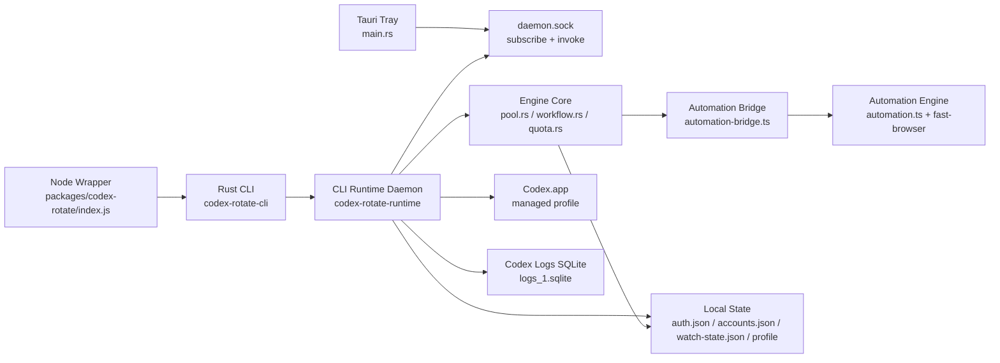
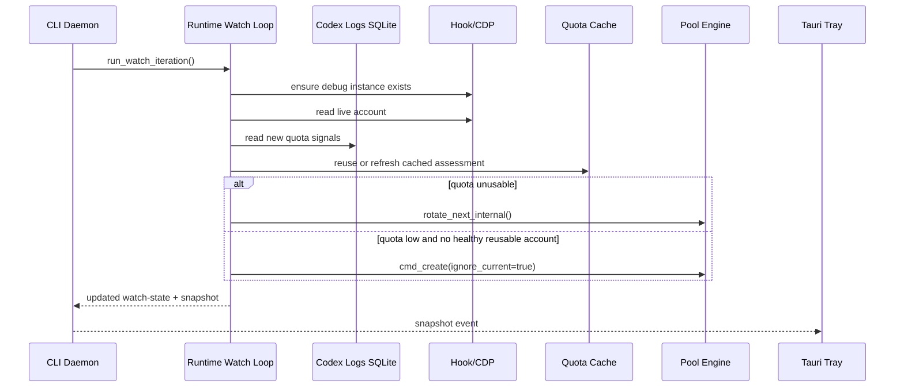
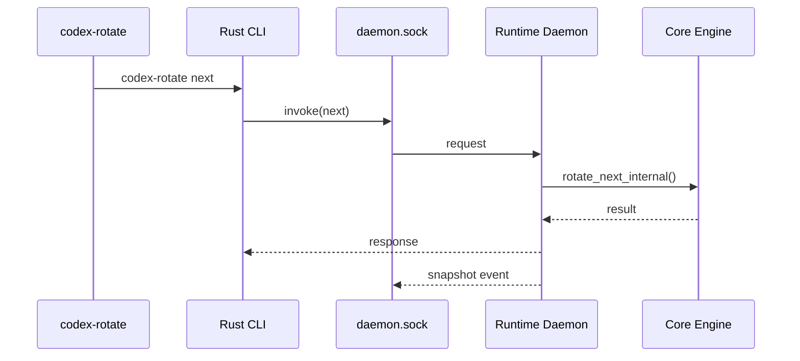

# Codex Rotate Architecture

## Summary

Codex Rotate is now CLI-owned end to end.

- The Rust CLI and daemon own the watch loop, managed Codex launch, live account sync, quota refresh, thread recovery, and create/relogin orchestration.
- The tray is a pure Tauri UI shell that starts or reattaches to the daemon and renders daemon snapshots over local IPC.
- TypeScript remains only at the npm wrapper and fast-browser automation boundary.
- `~/.codex-rotate-app` is a legacy migration source only and is removed after first successful migration.

## Runtime Map

| Layer               | Main files                                                                          | Responsibility                                                                        |
| ------------------- | ----------------------------------------------------------------------------------- | ------------------------------------------------------------------------------------- |
| Tray shell          | `packages/codex-rotate-app/src-tauri/src/main.rs`                                   | Menu, icon, daemon bootstrap, IPC subscription, user actions                          |
| CLI daemon runtime  | `packages/codex-rotate/crates/codex-rotate-runtime/src/*.rs`                        | Watch loop, launcher, CDP, logs, live sync, thread recovery, daemon IPC               |
| Shared engine core  | `packages/codex-rotate/crates/codex-rotate-core/src/*.rs`                           | Auth parsing, quota cache, pool engine, create/relogin orchestration                  |
| Rust CLI            | `packages/codex-rotate/crates/codex-rotate-cli/src/main.rs`                         | Stable `codex-rotate` command surface and `daemon run`                                |
| npm wrapper         | `packages/codex-rotate/index.js`                                                    | Thin Node launcher into the shipped native CLI                                        |
| Automation boundary | `packages/codex-rotate/automation.ts`, `packages/codex-rotate/automation-bridge.ts` | `fast-browser`, workflow metadata, Bitwarden secret refs, managed-browser Codex login |

## Component Diagram

## State and File Ownership

| File                               | Owner              | Notes                                                                    |
| ---------------------------------- | ------------------ | ------------------------------------------------------------------------ |
| `~/.codex/auth.json`               | Codex + Rust core  | Canonical active account tokens                                          |
| `~/.codex/logs_1.sqlite`           | Codex              | Signal source for quota and usage events                                 |
| `~/.codex-rotate/accounts.json`    | Rust core          | Account pool plus credential metadata (`version`, `families`, `pending`) |
| `~/.codex-rotate/watch-state.json` | CLI daemon runtime | Watch cursor, cooldown, cached quota assessment, thread-recovery state   |
| `~/.codex-rotate/profile/`         | CLI daemon runtime | Dedicated managed Codex `--user-data-dir`                                |
| `~/.codex-rotate/daemon.sock`      | CLI daemon runtime | Local IPC transport for CLI proxying and tray subscriptions              |

Removed files:

- `~/.codex-rotate/credentials.json`
- `~/.codex-rotate/session.json`
- `~/.codex-rotate-app/*`

## Hot Paths

### 1. Background watch iteration

### 2. CLI command while daemon is running

## Cross-Platform Seams

- Local control transport is isolated in `ipc.rs`.
  macOS/Linux use `~/.codex-rotate/daemon.sock`.
  Non-Unix targets currently return explicit unsupported errors instead of silently failing.
- Private file writes are isolated in `codex-rotate-core/src/fs_security.rs`.
- Managed Codex launch is isolated in `launcher.rs`.
  macOS supports full launch today.
  Other targets expose disabled capabilities and compile-safe fallbacks.
- Tray UI behavior is driven by daemon capability flags rather than OS guesses.

## Remaining TypeScript Surface

Intentional TS/JS files:

- `packages/codex-rotate/index.js`
  Packaging wrapper only. It resolves and executes a shipped native CLI binary.
- `packages/codex-rotate/index.ts`
  Legacy compatibility shim for existing npm or local links that still target `index.ts`.
- `packages/codex-rotate/automation-bridge.ts`
  JSON-over-stdio bridge for automation commands.
- `packages/codex-rotate/automation.ts`
  `fast-browser` integration and workflow helpers.
- `packages/codex-rotate/automation.test.ts`
  Automation-side tests only.
